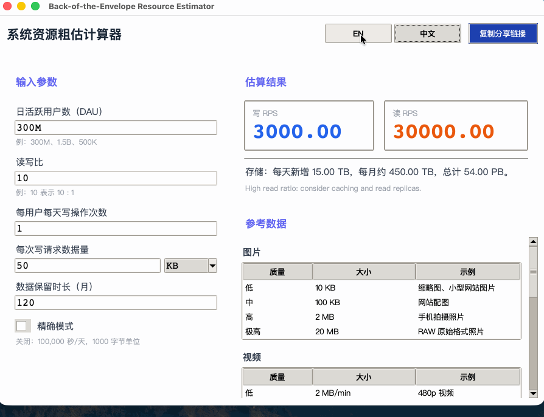

# Back-of-the-Envelope Resource Estimator

A desktop GUI application for system design resource estimation. Helps engineers quickly translate load parameters (DAU, read/write ratios, data sizes) into storage and throughput numbers.

Built with Python and Tkinter — zero third-party dependencies, single-file, runs anywhere Python 3.10+ is installed.


## Features

- Real-time calculation as you type
- Precision Mode toggle (rough 100k s/day vs exact 86400 s/day, 1000-byte vs 1024-byte units)
- DAU shorthand input: `300M`, `1.5B`, `500K`, `2T`
- Storage auto-formatted from bytes up to YB
- Design strategy hints based on read/write ratio
- Five reference tables: Images, Videos, Audio, Bandwidth, Datastore Latency
- Shareable link — encodes all params as a query string, copies to clipboard
- English / 中文 language toggle, switches instantly without restart
- Responsive layout from 900×600 to full screen



## Quick Start

```bash
# No installation required — standard library only
python estimator.py

# Start in Chinese
python estimator.py --lang zh

# Restore a saved parameter set
python estimator.py --params "?dau=300M&rw_ratio=10&writes=1&data=50&data_unit=KB&retention=120&precision=0"
```

**Requirements:** Python 3.10 or later. Tkinter is included in most Python distributions.
On Ubuntu/Debian, install it with:

```bash
sudo apt-get install python3-tk
```

On macOS, if it is not included, install it using Homebrew:

```bash
brew install python-tk
```


## Example Calculation

| Parameter | Value |
|---|---|
| Daily Active Users | 500,000 |
| Read:Write Ratio | 5:1 |
| Writes per User per Day | 1 |
| Data per Write | 50 KB |
| Retention | 10 years (120 months) |

**Results (Precision Mode Off):**

| Metric | Value |
|---|---|
| Write RPS | 5.00 |
| Read RPS | 25.00 |
| Daily Storage | 25 GB |
| Monthly Storage | 750 GB |
| Total Storage | 90 TB |


## Precision Mode

| Mode | Seconds / Day | Unit Base | Example |
|---|---|---|---|
| Off (default) | 100,000 | 1000 (KB, MB, GB...) | Rough estimate |
| On | 86,400 | 1024 (KiB, MiB, GiB...) | Precise calculation |


## Reference Tables (built-in)

**Images:** Low 10 KB / Medium 100 KB / High 2 MB / Very High 20 MB

**Videos:** Low 2 MB/min (480p) / Medium 20 MB/min (1080p) / High 80 MB/min (4K)

**Audio:** Low 700 KB / High 3 MB

**Bandwidth:** VoIP 80 Kbps → 4K streaming 25 Mbps

**Datastore Latency:** Disk 3 ms / SSD 0.2 ms (15x) / Memory 0.01 ms (300x)


## Project Documentation

| Document | Description |
|---|---|
| [Requirements Spec](docs/REQUIREMENTS.md) | Functional requirements, non-functional requirements, acceptance criteria, invariants |
| [Design Spec](docs/DESIGN.md) | Architecture, tech choices, module breakdown, data models, exception strategy |
| [Task Breakdown](docs/TASKS.md) | Implementation steps, test tasks, optional enhancements |


## Project Structure

```
bote-estimator/
├── estimator.py          # Single-file application — all code lives here
├── README.md
└── docs/
    ├── REQUIREMENTS.md   # Requirements Specification v3
    ├── DESIGN.md         # Design Specification v1
    └── TASKS.md          # Task Breakdown v1
```


## License

Apache-2.0 license
